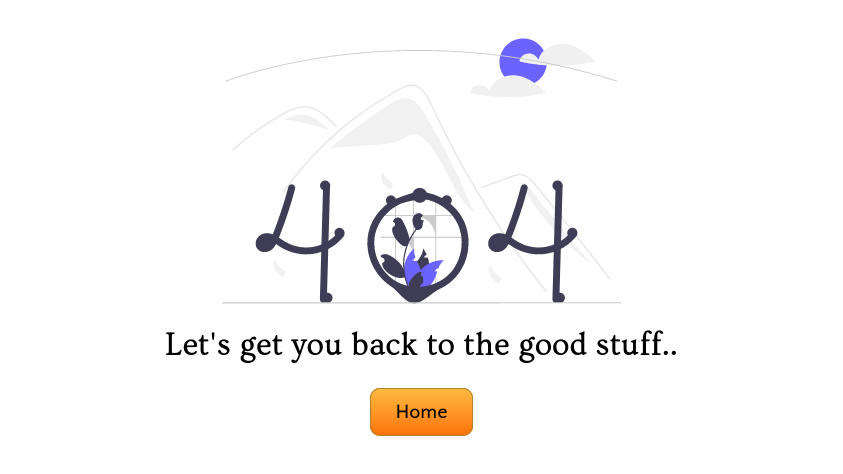

# Content Karma

Content Karma is a site designed to advertise the services of a content marketing and brand review company. The sites target audience is small to medium business owners who are interested in assistance creating content to engage with their customer base. The site aims to inform visitors of what the business has to offer and encourage them to get in contact.

<div align="center"></div>

## Demo
[View the live project here.](https://ianmeigh.github.io/content-karma/)

## Table of contents

- [User Experience (UX)](#user-experience-ux)
  - [User stories](#user-stories)
  - [Design](#design)
    - [Wireframes](#wireframes)
    - [Colour Scheme](#colour-scheme)
    - [Typography](#typography)
- [Features](#features)
  - [Future Development](#future-development)
- [Technologies Used](#technologies-used)
  - [Languages Used](#languages-used)
  - [Frameworks, Libraries & Programs Used](#frameworks-libraries--programs-used)
- [Testing](#testing)
  - [Further Testing](#further-testing)
  - [Fixed Bugs](#fixed-bugs)
  - [Remaining Known Bugs](#remaining-known-bugs)
- [Deployment](#deployment)
  - [GitHub Pages](#github-pages)
  - [Forking the GitHub Repository](#forking-the-github-repository)
  - [Making a Local Clone](#making-a-local-clone)
- [Credits](#credits)
  - [Code](#code)
  - [Content](#content)
  - [Media](#media)
  - [Acknowledgements](#acknowledgements)

## User Experience (UX)

  ### User stories

  User stories were created to help guide the design and implementation phases of the project and to ensure the needs of each stakeholder was understood.

  - #### First Time Visitor Goals

    - As a first time visitor:
      - I want to find out what services are offered.
      - I want to understand the cost of services.
      - I want to get a sense of how reputable to company is.
      - I want to know the benefits that content marketing can bring to my business.

  - #### Returning Visitor Goals

    - As a returning visitor:
      - I want to be able to get in contact quickly.
      - I want to check the staff and company's social media activity (may be linked to brand).

  - #### Business Owner Goals

    - As the business owner:
      - I want to generate business leads.

  ### Design
   - #### Wireframes
     - I created Wireframes to help me visualize the design for the site and have a template to use when I started to build the site sections.
       - Home Page Wireframe - [View](assets/images/readme-wireframes-desktop.png)
       - Mobile Wireframe - [View](assets/images/readme-wireframes-mobile.png)

  - #### Colour Scheme
    - The colour scheme was chosen to be calming and provide good contrast with the exception of the orange which was chosen to stand out (and because of it was a complimentary colour of the purple).
    <br>

  - #### Typography
    - The choice to use a serif and sans-serif font together was made to provide greater visual separation between headings and body text while still providing maximum legibility at reduced font size.

## Features
  - Heading and Navigation
    <div align="center"></div>
    <ul>
      <li>The navigation is featured at the top of each page and provides links to primary sections of the site.</li>
    </ul>

  - Hero Section
    <div align="center"></div>
    <ul>
      <li>Provides a clear indication of the purpose of the site and a call to action for returning visitors to get in contact.</li>
    </ul>

  - Services Section
    <div align="center"></div>
    <ul>
      <li>Displays the core services offered by the business in a concise way.</li>
      <li>Imaginary used to compliment the wording and provide further context for sighted visitors.</li>
      <li>Link at the bottom of the section to a page which shows a video of why content marketing is important for businesses.</li>
    </ul>

  - Why Invest Page
      <div align="center"></div>
      <ul>
        <li>This page is linked below the services section to highlight the benefits of content marketing.</li>
      </ul>

  - Team Section
    <div align="center"></div>
    <ul>
      <li>Provides an introduction to the staff of the business whom the visitor could work with.</li>
      <li>Aim to humanize the business and build a personal connection with the visitor.</li>
      <li>Links to social channels build legitimacy as these can be visited to see personnel's professional activity.</li>
    </ul>

  - Pricing Section
    <div align="center"></div>
    <ul>
      <li>Advertise to visitors what combinations of services are available.</li>
      <li>Provides an indication as to the cost of services.</li>
      <li>Call to action at the bottom of the section prompting visitors to get in touch to request a quote and or discuss a bespoke service.</li>
    </ul>

  - Testimonials
    <div align="center"></div>
    <ul>
      <li>Build trust in the brand by showing examples of satisfied customers.</li>
    </ul>

  - Contact Form
    <div align="center"></div>
    <ul>
      <li>Generate a business lead by allowing the visitor of the site to send a message to the site owner.</li>
      <li>A subject field prompts the visitor as to the topic of the enquiry which guides the user and would assist in prioritization of the queries by the back office team, all fields are mandatory to ensure the maximum information is gathered.</li>
    </ul>

  - Footer
    <div align="center"></div>
    <ul>
      <li>Provide a link to the social pages for the business and show copyright information.</li>
    </ul>

  - 404 Page
    <div align="center"></div>
    <ul>
      <li>Provides a way for visitors to get back to the main page if a bookmarked link is chnaged of there is a navigation error.</li>
    </ul>
    
  - ### Future Development
    - Expansion of the why invest page
      - Display reasons to invest in a textual and graphical mix which can be read by screen readers.
    - Carousel
      - Would display on mobile screens for the services and testimonials sections to reduce their height and the need for vertical scrolling.
    - Back-to-top button
      - Allowing visitor to jump to the top of the page in lue of a fixed/sticky navigation menu.
    - Blog
      - To allow business owner to demonstrate content writing ability and highlight the reasons content marketing is important.
    - Email Newsletter
      - To link to blog content (back to site), share content tips and keep subscribers up to date with services. Entry point to convert customers who signed up for free tips to paid services and re-engage previous customers.

## Technologies Used

  ### Languages Used

  - HTML5
  - CSS3

  ### Frameworks, Libraries & Programs Used

  1. [Google Fonts:](https://fonts.google.com/)
      - Google fonts import statements were used as part of this project to make use of the Ovo and Quattrocento Sans fonts which are used on all pages of the website.
  1. [Font Awesome:](https://fontawesome.com/)
      - Font Awesome was used on all pages of the website to add social media icons.
  1. [Visual Studio Code:](https://code.visualstudio.com/)
      - Visual Studio Code was used as my code editor for this project. A full list of plugins used can be found in the CREDITS section. 
  1. [Git](https://git-scm.com/)
      - Git was used for version control, using the terminal to commit to Git and Push to GitHub.
  1. [GitHub:](https://github.com/)
      - GitHub is used to store the projects code after being pushed from Git.
  1. [GIMP:](https://www.gimp.org/)
      - GIMP was used to create the logo, and edit and resize photos for the website.
  1. [Balsamiq:](https://balsamiq.com/)
      - Balsamiq was used to create the [wireframes](#wireframes) during the design process.

## Testing

  The [W3C Markup Validator](https://validator.w3.org/nu/) and [W3C CSS Validator](https://jigsaw.w3.org/css-validator/) Services were used to validate every page of the project to ensure there were no syntax errors in the project.

  All test pass with no errors and the results can be viewed by visiting the linked pages below: 

  -   [Results for index page (HTML)](https://validator.w3.org/nu/?doc=https%3A%2F%2Fianmeigh.github.io%2Fcontent-karma%2Findex.html)
  -   [Results for why-invest page (HTML)](https://validator.w3.org/nu/?doc=https%3A%2F%2Fianmeigh.github.io%2Fcontent-karma%2Fwhy-invest.html)
  -   [Results for CSS](https://jigsaw.w3.org/css-validator/validator?uri=https%3A%2F%2Fianmeigh.github.io%2Fcontent-karma%2F&profile=css3svg&usermedium=all&warning=1&vextwarning=&lang=en)

  ### Further Testing

  - Tested using the Chrome Lighthouse tools, scores below:
    - index.html
      - Desktop
        <br>
      - Mobile
      <br>
    - why-invest.html
      - Desktop
        <br>
      - Mobile
        <br>
  - Tested using a Firefox, Chrome, Web (GNOME WebKitGTK browser), an iPad and an iPhone SE for inconsistencies.

  ### Fixed Bugs

  Throughout the project a number of issue were identified from continual testing:

  - Design Decisions
    - The services and team/about section were swapped as it was decided that services should be below the page fold and were more important to page flow.
    - A page to help show why it was worth investing in content marketing was added to include a multimedia element and help educate the visitor and address and help ease any investment concerns.
    - Initial colours were based on the SVG images used on the site and its complimentary colour (orange). 
    White text against this background colour (#6c63ff / rgb(236, 236, 236)) failed the Google Chrome lighthouse contrast check so the colour scheme was reviewed to ensure better contrast.
  - Code
    - Initially the header was set to 100 viewport width but this caused an overflow issue. Units were changed to percentage to resolve this.
      - [Link to commit](https://github.com/ianmeigh/content-karma/commit/03e7cb6999caa4efd3875f190447d4d006264a3d)
    - Google Chrome Lighthouse tools highlighted a performance issue caused by an image ratio. This was corrected to a 1:1 sizing ratio.
      - [Link to commit](https://github.com/ianmeigh/content-karma/commit/d756139dbf5275ae2a1464251a6c317ca73b151b)
    - The incorrect selector :nth-child() replaced with :nth-of-type() to allow elements to be placed  between the sections without affecting indexing and therefore section background colour. This was noticed when the section separator image was added between the hero and services sections.
      - [Link to commit](https://github.com/ianmeigh/content-karma/commit/1ec107368bfa9dbe339157a2feb8787d3ce89fec)
    - Google Chrome Lighthouse tools highlighted that all links which have no text content should have  aria-labels for accessibility so these were added.
      - [Link to commit](https://github.com/ianmeigh/content-karma/commit/3dc899c5343e576181c1bd1b8a42b6f0f7a6ad65)
    - Google Chrome Lighthouse tools highlighted multiple issues which were corrected as follows:
      - iframe's frameborder attribute is depreciated in HTML5. This was changed to use the CSS border property.
        - [Link to commit](https://github.com/ianmeigh/content-karma/commit/5c609fdcd656d92f7ca8905c58c8da30286ce750)
      - Vendor specific CSS properties needed to be removed to pass tests and the pointer-events and scroll-behavior property values I had used were not compliant.
        - Resolved with multiple commits:
          1. [Link to commit](https://github.com/ianmeigh/content-karma/commit/37c11f85e5780b181b8d18d8ac5dbf957bce29e0)
          1. [Link to commit](https://github.com/ianmeigh/content-karma/commit/59ab4417cd7bee5401efb68a0aa327aba999ef3b)
    - The SVG section separator was displaying with a gap in between the section above, stackoverflow provided the answer to add a negative margin to the image.
      - [Link to stackoverflow](https://stackoverflow.com/questions/64600824/white-gap-between-svg-and-div)

  ### Remaining Known Bugs
  - None

## Deployment

  ### GitHub Pages
  The project was deployed to GitHub Pages using the following steps...
  1. Log in to GitHub and locate the [GitHub Repository](https://github.com/ianmeigh/content-karma)
  2. At the top of the Repository (not top of page), locate the "Settings" Button on the menu.
  3. Select "Pages" from the vertical navigation on the left of the page.
  4. Under "Source", click the dropdown displaying "None" and select "Main".
  5. Click the "Save" button.
  6. The link to the deployed page will now be displayed in the "pages" section.

  ### Forking the GitHub Repository

  By forking the GitHub Repository we make a copy of the original repository on our GitHub account to view and/or make changes without affecting the original repository by using the following steps...

  1. Log in to GitHub and locate the [GitHub Repository](https://github.com/ianmeigh/content-karma)
  2. At the top of the Repository (not top of page) just above the "Settings" Button on the menu, locate the "Fork" Button.
  3. Click the button (not the number to the right) and you should now have a copy of the original repository in your GitHub account.

  ### Making a Local Clone

  1. Log in to GitHub and locate the [GitHub Repository](https://github.com/ianmeigh/content-karma)
  2. Under the repository name, click "Code".
  3. To clone the repository using HTTPS, under "HTTPS", copy the link.
  4. Open your local terminal with git installed
  5. Change the current working directory to the location where you want the cloned directory to be created.
  6. Type `git clone `, and then paste the URL you copied in Step 3.

  ```
  $ git clone https://github.com/ianmeigh/content-karma.git
  ```

  7. Press Enter. Your local clone will be created.

  ```
  $ git clone https://github.com/ianmeigh/content-karma.git
  > Cloning into `test-dir`...
  > remote: Counting objects: 10, done.
  > remote: Compressing objects: 100% (8/8), done.
  > remove: Total 10 (delta 1), reused 10 (delta 1)
  > Unpacking objects: 100% (10/10), done.
  ```

  [Click here](https://help.github.com/en/github/creating-cloning-and-archiving-repositories/cloning-a-repository#cloning-a-repository-to-github-desktop) to retrieve pictures for some of the buttons and more detailed explanations of the above process.

## Credits

  ### Code

  1. [buttonoptimizer.com:](https://buttonoptimizer.com/)
      - Used to create the styling for buttons.
  1. [TinyJPG:](https://tinyjpg.com/)
      - Used for image compression.
  1. [stackoverflow:](https://stackoverflow.com)
      - Used to troubleshoot the alignment and spacing of SVG content (detailed in the [Fixed Bugs](#fixed-bugs) section).
  1. [Free tool from ILMIGO:](https://www.ilmigo.com/tools/responsive-youtube-embed-code-generator/)
      - Responsive YouTube Embed Code Generator was used to generate HTML and CSS for embedding YouTube video.
  1. [Timothy Long - codepen.io:](https://codepen.io/timothylong/pen/HhAer/)
      - Code used for the form submission modal/popup.
  1. [Code Institute Sample README](https://github.com/Code-Institute-Solutions/SampleREADME)
      - Element of the README were copied and adapted from the Code Institute sample readme.
  1. The following [Visual Studio Code](https://code.visualstudio.com/) extensions were utilized in the production of this project:
      - [Beautify](https://marketplace.visualstudio.com/items?itemName=HookyQR.beautify) - Used for code refact­oring.
      - [Rewrap](https://marketplace.visualstudio.com/items?itemName=stkb.rewrap) - Used to wrap comments and site text.
      - [Code Spell Checker](https://marketplace.visualstudio.com/items?itemName=streetsidesoftware.code-spell-checker) - Used to spell check content and commits.
      - [Live Server](https://marketplace.visualstudio.com/items?itemName=ritwickdey.LiveServer) - Used to provide a locally hosted live preview of the site during development.

  ### Content

  1. [Food Blogger Pro:](https://www.foodbloggerpro.com/)
      - Layout inspiration
  1. [type-scale.com:](https://type-scale.com/)
      - Major Third type scale used for project.
  1. [Reliable - Font Pairings:](https://www.reliablepsd.com/ultimate-google-font-pairings/)
      - Font inspiration from paring #25
  1. Website wording was adapted from the following sources:
      - [thecontentqueen.net](https://thecontentqueen.net/content-solutions/)
      - [contentkarma.com](https://www.contentkarma.com/services/content-marketing)

  ### Media

  1. [Unsplash:](https://unsplash.com/)
      - Unsplash was used to find free to use portraits for the project.
  1. [unDraw:](https://undraw.co/)
      - unDraw was used for open source illustrations used for the project.
  1. [Free Tools by Softr:](https://www.softr.io/tools/)
      - The SVG wave and shape generator tools were used to create media for the project.
  1. [FaviconGURU:](https://favicon.guru/)
      - Used to convert PNG file to Icon
  1. [YouTube -  Antigravity Films:](https://www.youtube.com/watch?v=dMkOrLriJUQ&t=2s)
      - Video explaining content marketing hosted on YouTube and produced by Antigravity Films, reuse allowed under the [CC BY](https://creativecommons.org/licenses/by/3.0/legalcode) which is applied to the video.

  ### Acknowledgements

  - My mentor for their advise, encouragement and support throughout this project.
  - The Code Institute Slack community.